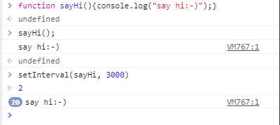

# Making a JS Clock

### querySelector
+ element의 자식을 탐색
  

### setInterval
~~~
setInterval(fn, 1000)
~~~
+ 일정한 시간 간격으로 작업을 수행하기 위해서 사용
+ clearInterval 함수를 사용하여 중지할 수 있음
+ 🔥 주의할 점은 일정한 시간 간격으로 실행되는 작업이 그 시간 간격보다 오래걸리는 문제 발생할 수 있다.
 

  

### ↔ setTimeout
+ 일정한 시간 후에 작업을 한번  실행
+ 재귀적 호출을 사용하여 작업을 반복
+ 기본적으로 setInterval과는 달리 지정된 시간을 기다린 후, 작업을 수행하고 다시 일정한 시간을 기다린 후 작업을 수행하는 방식
+ 지정된 시간 사이에 작업시간이 추가되는 것
  

### clearInterval, clearTimeout
+ 실행중인 작업을 중지시키는 것은 아님
+ 지정된 작업은 모두 실행되고 다음 작업 스케줄이 중지 되는것
  

### 삼항 조건 연산자
~~~~
condition ? exprIfTrue : exprIfFalse 
~~~
+ If 의 단축형태
+ 조건부 삼항 연산자는 JavaScript에서 세 개의 피연산자를 취할 수 있는 유일한 연산자
