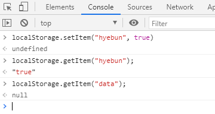
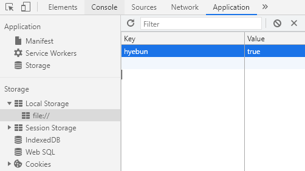

# Saving the User Name part1
사용자 이름을 저장하는 방법

### getElementByTagName

태그를 가져오는 것

+ input
+ body
+ html
+ div
+ section 

## 로컬스토리지 이용해 값을 저장하고 가져오기
+ 값을 localstorage에 저장하고, 가져오기
+ 없는 값은 null로뜸 (undefined와 동일)

+ 저장된 값 확인

 

📢 index.html 수행후, 개발자모드에서 Application localStorage에 currentUser 추가후, 결과 확인
